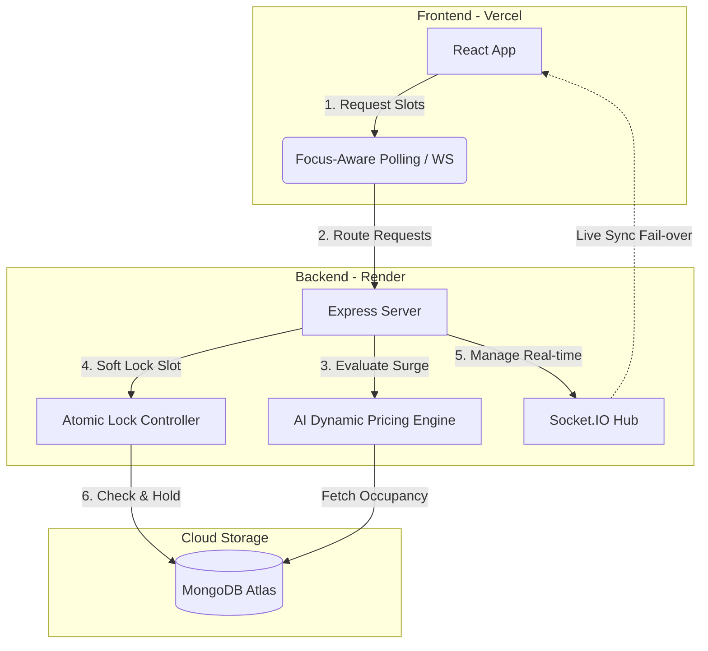
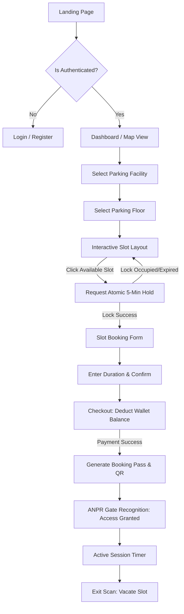
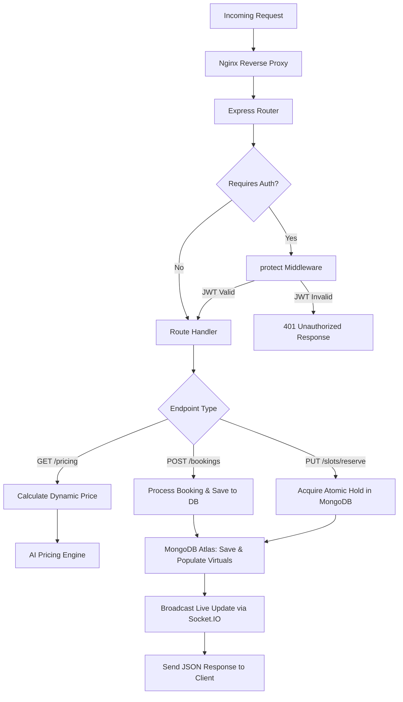
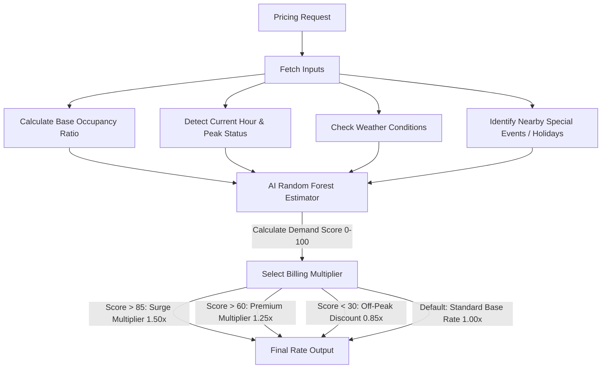
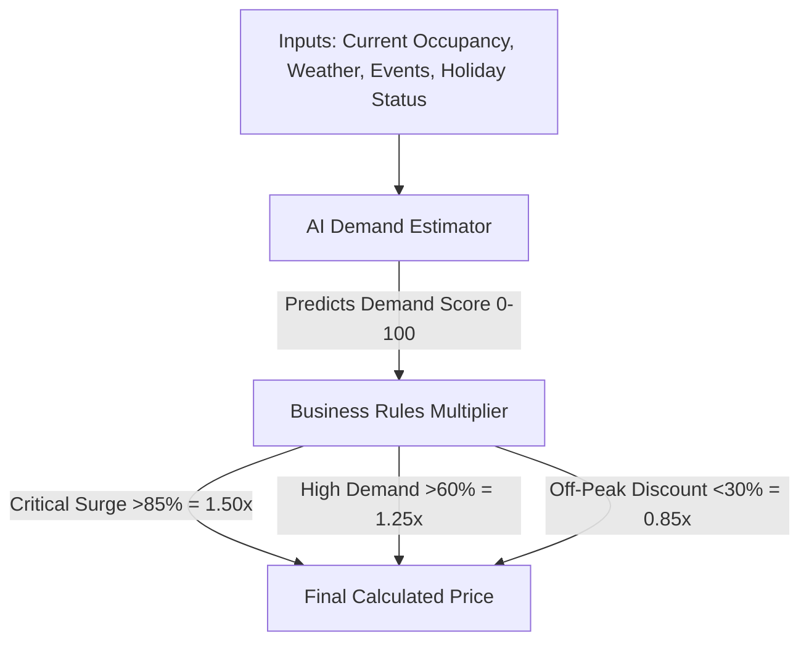
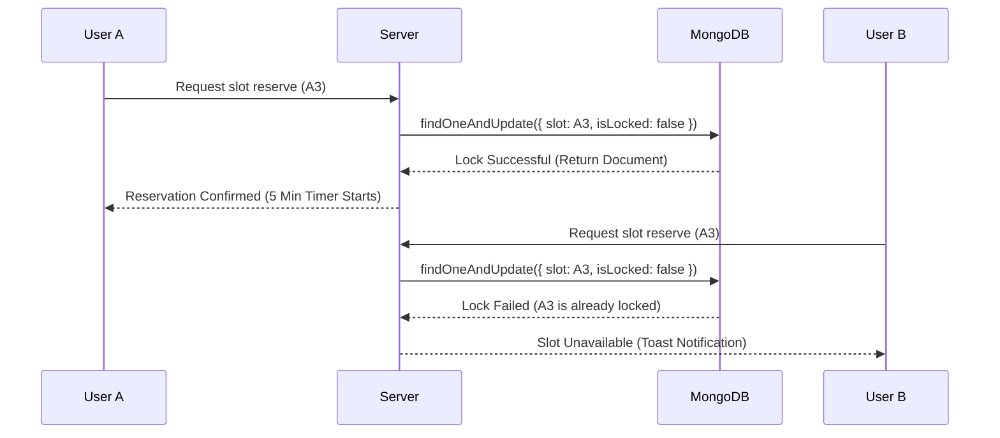

# 🌌 Drivix – AI-Powered Smart Parking Ecosystem

[](https://react.dev)
[](https://nodejs.org)
[](https://mongodb.com)
[](https://render.com)
[](https://vercel.com)
[](https://socket.io)

**Drivix** is a premium, AI-powered smart parking ecosystem designed to eliminate urban parking congestion. By combining **ANPR (Automatic Number Plate Recognition)**, real-time slot tracking, smart locking, and a hybrid dynamic pricing engine, Drivix turns the "search for parking" into a seamless digital flight.

---

### 🌐 [Live Production Link (Vercel)](https://drivix-pearl.vercel.app/)

---

## 🛠️ System Architecture

Drivix uses a decoupled, hybrid-polling micro-architecture designed to maintain real-time sync across modern cloud hosting boundaries.



---

## 📊 Flowcharts & Workflows

### 1. Frontend Application Navigation Flow



### 2. Backend API Request Routing



### 3. AI Dynamic Pricing Model Engine



---

## ⚙️ Core Engineering Concepts (Deep Dive)

### 🧠 1. Hybrid Dynamic Pricing Model Details

Drivix optimizes facility occupancy and revenue using a dual-layer pricing engine combining machine learning prediction with safety-critical business rules:



* **Explainable AI Integration**: Instead of letting a black-box model set prices directly (which is risky and non-auditable), the AI estimates the demand score while deterministic business rules scale the multiplier.

### 🔒 2. Atomic Slot Locks (Concurrency Protection)

To prevent race conditions where two users attempt to capture the same parking slot at the exact same millisecond, Drivix utilizes an atomic soft-lock algorithm:



* **Auto-Release Worker**: A server-side scheduler runs continuously to sweep the database and release soft locks for slots where the 5-minute checkout window has expired without payment.

### 📡 3. Serverless Socket.IO Smart Polling Fallback

Because Vercel serverless functions freeze after delivering an HTTP response, persistent WebSocket channels can experience connection timeouts. Drivix implements a client-side wrapper:

* **WebSocket Priority**: Tries to connect using active Socket.IO streams.
* **Focus-Aware Fallback**: If disconnected, shifts to a 4-second API polling schedule.
* **Tab-Activity Guard**: Polling completely pauses when the browser tab goes into the background, preventing rate-limiting and unnecessary database reads.

### ⏱️ 4. Free-Tier Server Cold Start Mitigation (cron-job.org)

To circumvent the 50-second "cold start" delay associated with Render's Free tier (where container instances spin down after 15 minutes of inactivity), Drivix is integrated with a keep-alive scheduler:
* **Periodic Ping**: Configured via [cron-job.org](https://cron-job.org/) to trigger an HTTP GET request to `https://drivix-backend-0qvx.onrender.com/` every 10 minutes.
* **Warm Containers**: This persistent ping maintains the active state of the Node container, guaranteeing sub-second response times for end-users visiting the application.

---

## ⚙️ Technology Stack

* **Frontend**: React + Vite
* **Styling**: Vanilla CSS (Pill Navigation, Glassmorphism, Responsive Viewports)
* **Animations**: Framer Motion & Lucide Icons
* **Backend**: Node.js + Express.js + Socket.IO
* **Database**: MongoDB Atlas (configured with Virtual Populates to keep documents O(1) in size)
* **Hosting**: Vercel (Frontend) & Render (Backend)

---

## 🚀 Local Installation & Setup

Follow these steps to run the entire Drivix ecosystem on your local machine:

### 1. Clone the repository

```bash
git clone https://github.com/sajidtecho/Drivix.git
cd Drivix
```

### 2. Configure Backend Variables

Create a `.env` file in the `/backend` folder:

```env
PORT=5000
MONGO_URI=your_mongodb_atlas_connection_string
JWT_SECRET=your_jwt_secret_key
```

### 3. Run Backend Server

```bash
cd backend
npm install
npm run dev
```

### 4. Configure Frontend URL

In `frontend/src/config.js`, set your backend API path:

```javascript
export const API_BASE_URL = import.meta.env.VITE_API_URL || 'http://localhost:5000';
```

### 5. Run Frontend Client

```bash
cd ../frontend
npm install
npm run dev
```

---

*Designed with ❤️ for the Smart Cities of tomorrow.*
