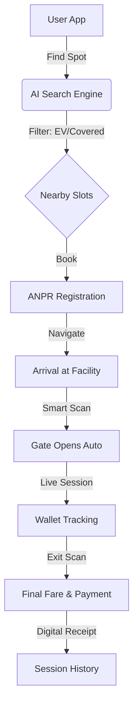

# 🌌 Drivix – smart parking system

**Drivix** is a premium, AI-powered smart parking ecosystem designed to eliminate the anxiety and time-loss associated with urban parking. By combining **ANPR (Automatic Number Plate Recognition)**, real-time slot tracking, and a seamless digital wallet, Drivix turns the "search for parking" into a "flight to destination."

---

## 🚀 The Vision: Why Drivix?

### 🛑 The Problem
Searching for parking in modern cities is a nightmare. It contributes to **30% of urban traffic**, increases carbon emissions, and costs drivers an average of **20 minutes per journey**. Manual ticketing and cash-only systems are slow, insecure, and outdated.

### ✨ The Solution
Drivix provides a **"Celestial Navigation"** experience for your vehicle. Our platform allows users to find, book, and access high-security parking facilities without ever stepping out of their car or touching a physical ticket.

---

## 🛰️ How Drivix Helps People

Drivix isn't just a booking app; it's a productivity multiplier:

1.  **⚡ Zero Latency Access**: Your vehicle plate is your ID. Smart cameras recognize your car and open the gates automatically.
2.  **🔋 Future-Ready**: Integrated EV charging selection ensures your car is powered up while you work or shop.
3.  **💳 Frictionless Payments**: A central wallet automatically handles fares based on your actual parking duration—down to the minute.
4.  **📂 Digital Vault**: Store your DL, RC, and Insurance securely. Never worry about traffic stops again.
5.  **✨ Premium Experience**: A high-fidelity, glassmorphism UI designed for maximum readability and visual delight.

---

## 🛠️ The Drivix Ecosystem (Flowchart)


---

## 💎 Features at a Glance

-   **🛰️ Smart Discovery**: Find real-time available slots near your destination.
-   **🚗 ANPR Integration**: Link your vehicle plate for automated parking entry/exit.
-   **⚡ EV Charging**: Book spots with dedicated charging infrastructure.
-   **🔒 Secure Vault**: End-to-end encrypted storage for your vehicle documents.
-   **⏱️ Live Sessions**: Real-time tracking of your parking duration and running costs.
-   **💰 Drivix Wallet**: One-tap payments and automatic balance management.

---

## ⚙️ Technology Stack

-   **Frontend**: React + Vite
-   **Styling**: Vanilla CSS (Celestial Design System)
-   **Animations**: Framer Motion & Lucide Icons
-   **Backend**: Google Firebase (Authentication & Firestore)
-   **Data Storage**: Real-time Document Snapshots

---

## 🛡️ Security & Environment Setup

To keep the application secure, we use environment variables for Firebase configuration. 

### 1. Create a `.env` file
Add your Firebase credentials to a `.env` file in the root directory:

```env
VITE_FIREBASE_API_KEY=your_api_key
VITE_FIREBASE_AUTH_DOMAIN=your_project.firebaseapp.com
VITE_FIREBASE_PROJECT_ID=your_project_id
VITE_FIREBASE_STORAGE_BUCKET=your_project.appspot.com
VITE_FIREBASE_MESSAGING_SENDER_ID=your_sender_id
VITE_FIREBASE_APP_ID=your_app_id
```

### 2. Run the App
```bash
npm install
npm run dev
```

---

*Designed with ❤️ by the Drivix Team for the Smart Cities of tomorrow.*
