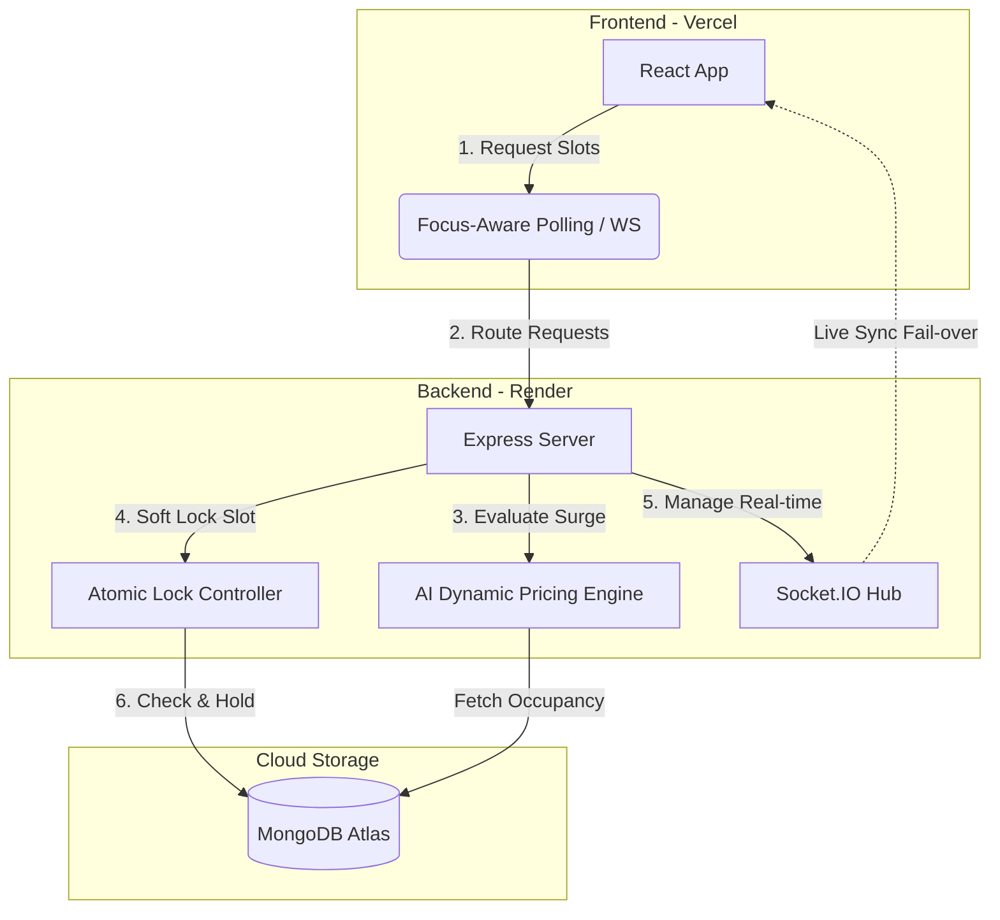
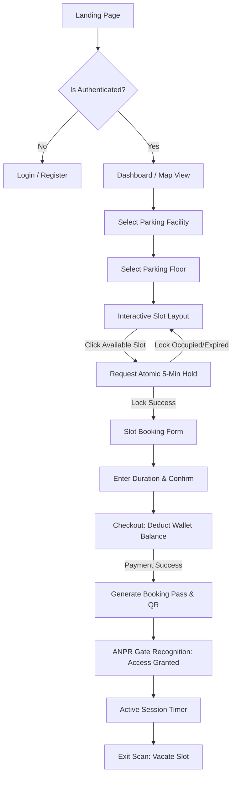
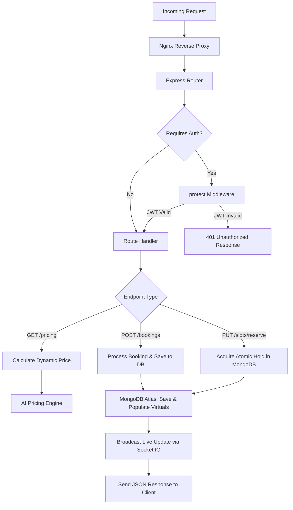
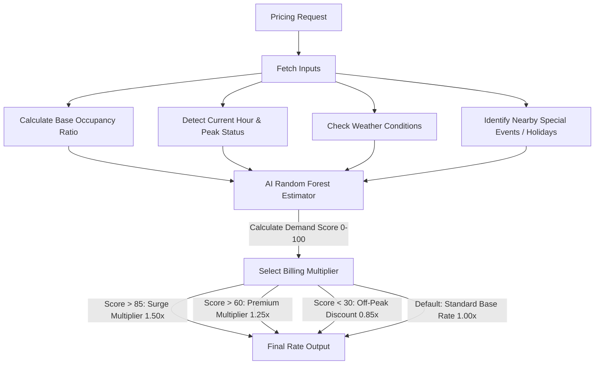
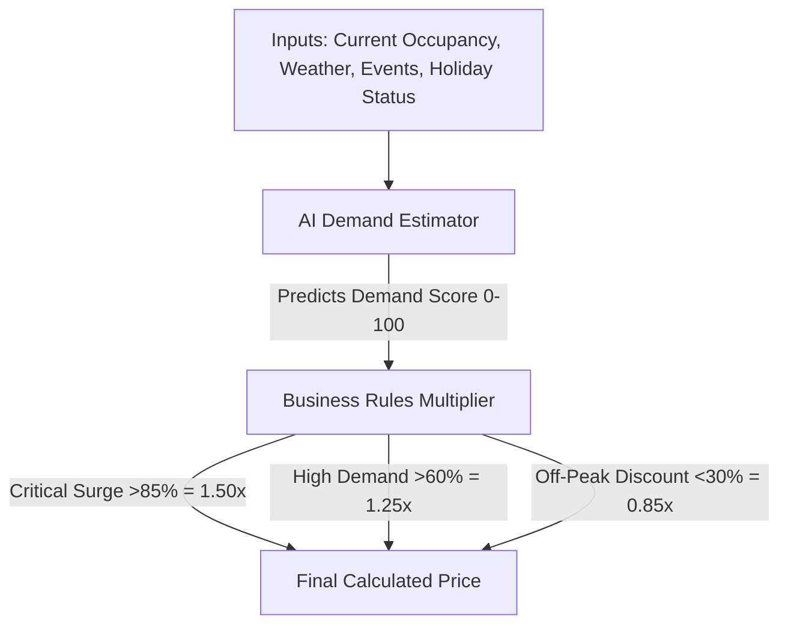
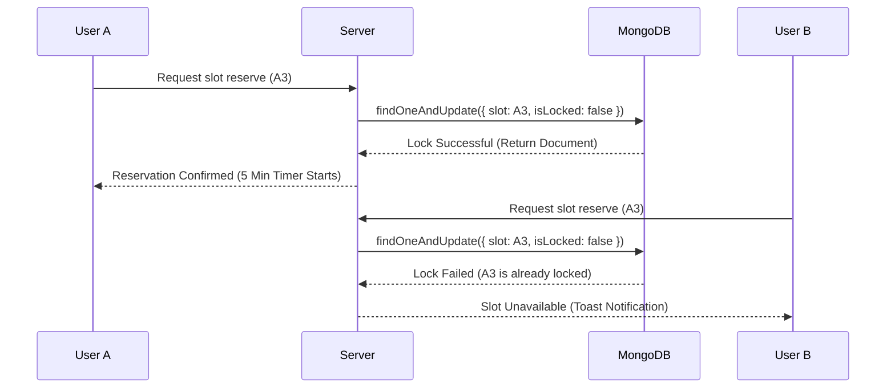
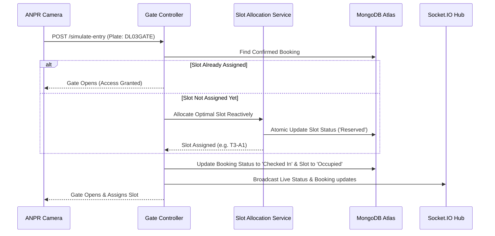

#  Drivix – AI-Powered Smart Parking Ecosystem

[](https://react.dev)
[](https://nodejs.org)
[](https://mongodb.com)
[](https://render.com)
[](https://vercel.com)
[](https://socket.io)

**Drivix** is a premium, AI-powered smart parking ecosystem designed to eliminate urban parking congestion. By combining **ANPR (Automatic Number Plate Recognition)**, real-time slot tracking, smart locking, and a hybrid dynamic pricing engine, Drivix turns the "search for parking" into a seamless digital flight.

---

### 🌐 [Live Production Link (Vercel)](https://drivix-pearl.vercel.app/)

---

## 📂 Repository Structure

The Drivix ecosystem is composed of three main subsystems organized in a monorepo structure:

*   **[WebApp/](file:///d:/DrivixApps/WebApp)**: The primary web interface and backend API server.
    *   **[frontend/](file:///d:/DrivixApps/WebApp/frontend)**: A high-fidelity, premium React web app built with Vite and styled using custom Vanilla CSS (featuring glassmorphism and modern HUD indicators).
    *   **[backend/](file:///d:/DrivixApps/WebApp/backend)**: An Express.js REST API server handling user authentication, atomic slot soft-locking, real-time Socket.IO broadcasts, and gate entry/exit simulator logic.
*   **[App/](file:///d:/DrivixApps/App)**: A cross-platform mobile application built using Expo and React Native, featuring a premium sci-fi radar map component, real-time location tracking, and an animated HUD overlay.
*   **[ml_service/](file:///d:/DrivixApps/ml_service)**: A Python-based machine learning subsystem designed to preprocess transaction data, train predictive models (like Random Forest), and evaluate pricing demand estimations.

---

## 🛠️ System Architecture

Drivix uses a decoupled, hybrid-polling micro-architecture designed to maintain real-time sync across modern cloud hosting boundaries.


```mermaid
graph TD
    subgraph Client Layer [Frontend - Vercel]
        A[React App] -->|1. Request Slots| B(Focus-Aware Polling / WS)
    end

    subgraph Service Layer [Backend - Render]
        B -->|2. Route Requests| C[Express Server]
        C -->|3. Evaluate Surge| D[AI Dynamic Pricing Engine]
        C -->|4. Soft Lock Slot| E[Atomic Lock Controller]
        C -->|5. Manage Real-time| F[Socket.IO Hub]
    end

    subgraph Database Layer [Cloud Storage]
        E -->|6. Check & Hold| G[(MongoDB Atlas)]
        D -->|Fetch Occupancy| G
    end
    
    F -.->|Live Sync Fail-over| A
```

---

## 📊 Flowcharts & Workflows

### 1. Frontend Application Navigation Flow


```mermaid
graph TD
    A[Landing Page] --> B{Is Authenticated?}
    B -->|No| C[Login / Register]
    B -->|Yes| D[Dashboard / Map View]
    D --> E[Select Parking Facility]
    E --> F[Select Parking Floor]
    F --> G[Interactive Slot Layout]
    G -->|Click Available Slot| H[Request Atomic 5-Min Hold]
    H -->|Lock Success| I[Slot Booking Form]
    H -->|Lock Occupied/Expired| G
    I --> J[Enter Duration & Confirm]
    J --> K[Checkout: Deduct Wallet Balance]
    K -->|Payment Success| L[Generate Booking Pass & QR]
    L --> M[ANPR Gate Recognition: Access Granted]
    M --> N[Active Session Timer]
    N --> O[Exit Scan: Vacate Slot]
```

### 2. Backend API Request Routing


```mermaid
graph TD
    A[Incoming Request] --> B[Nginx Reverse Proxy]
    B --> C[Express Router]
    C --> D{Requires Auth?}
    D -->|Yes| E[protect Middleware]
    D -->|No| F[Route Handler]
    E -->|JWT Valid| F
    E -->|JWT Invalid| G[401 Unauthorized Response]
    F --> H{Endpoint Type}
    H -->|GET /pricing| I[Calculate Dynamic Price]
    H -->|POST /bookings| J[Process Booking & Save to DB]
    H -->|PUT /slots/reserve| K[Acquire Atomic Hold in MongoDB]
    I --> L[AI Pricing Engine]
    J --> M[MongoDB Atlas: Save & Populate Virtuals]
    K --> M
    M --> N[Broadcast Live Update via Socket.IO]
    N --> O[Send JSON Response to Client]
```

### 3. AI Dynamic Pricing Model Engine


```mermaid
graph TD
    A[Pricing Request] --> B[Fetch Inputs]
    B --> C[Calculate Base Occupancy Ratio]
    B --> D[Detect Current Hour & Peak Status]
    B --> E[Check Weather Conditions]
    B --> F[Identify Nearby Special Events / Holidays]
    C & D & E & F --> G[AI Random Forest Estimator]
    G -->|Calculate Demand Score 0-100| H[Select Billing Multiplier]
    H -->|Score > 85: Surge Multiplier 1.50x| I[Final Rate Output]
    H -->|Score > 60: Premium Multiplier 1.25x| I
    H -->|Score < 30: Off-Peak Discount 0.85x| I
    H -->|Default: Standard Base Rate 1.00x| I
```

---

## ⚙️ Core Engineering Concepts (Deep Dive)

### 🧠 1. Hybrid Dynamic Pricing Model Details

Drivix optimizes facility occupancy and revenue using a dual-layer pricing engine combining machine learning prediction with safety-critical business rules:


```mermaid
graph TD
    A[Inputs: Current Occupancy, Weather, Events, Holiday Status] --> B[AI Demand Estimator]
    B -->|Predicts Demand Score 0-100| C[Business Rules Multiplier]
    C -->|Critical Surge >85% = 1.50x| D[Final Calculated Price]
    C -->|High Demand >60% = 1.25x| D
    C -->|Off-Peak Discount <30% = 0.85x| D
```

* **Explainable AI Integration**: Instead of letting a black-box model set prices directly (which is risky and non-auditable), the AI estimates the demand score while deterministic business rules scale the multiplier.

### 🔒 2. Atomic Slot Locks (Concurrency Protection)

To prevent race conditions where two users attempt to capture the same parking slot at the exact same millisecond, Drivix utilizes an atomic soft-lock algorithm:


```mermaid
sequenceDiagram
    participant User A
    participant Server
    participant MongoDB
    participant User B

    User A->>Server: Request slot reserve (A3)
    Server->>MongoDB: findOneAndUpdate({ slot: A3, isLocked: false })
    MongoDB-->>Server: Lock Successful (Return Document)
    Server-->>User A: Reservation Confirmed (5 Min Timer Starts)
    
    User B->>Server: Request slot reserve (A3)
    Server->>MongoDB: findOneAndUpdate({ slot: A3, isLocked: false })
    MongoDB-->>Server: Lock Failed (A3 is already locked)
    Server-->>User B: Slot Unavailable (Toast Notification)
```

* **Auto-Release Worker**: A server-side scheduler runs continuously to sweep the database and release soft locks for slots where the 5-minute checkout window has expired without payment.

### 📡 3. Serverless Socket.IO Smart Polling Fallback

Because Vercel serverless functions freeze after delivering an HTTP response, persistent WebSocket channels can experience connection timeouts. Drivix implements a client-side wrapper:

* **WebSocket Priority**: Tries to connect using active Socket.IO streams.
* **Focus-Aware Fallback**: If disconnected, shifts to a 4-second API polling schedule.
* **Tab-Activity Guard**: Polling completely pauses when the browser tab goes into the background, preventing rate-limiting and unnecessary database reads.

### ⏱️ 4. Free-Tier Server Cold Start Mitigation (cron-job.org)

To circumvent the 50-second "cold start" delay associated with Render's Free tier (where container instances spin down after 15 minutes of inactivity), Drivix is integrated with a keep-alive scheduler:
* **Periodic Ping**: Configured via [cron-job.org](https://cron-job.org/) to trigger an HTTP GET request to `https://drivix-backend-0qvx.onrender.com/` every 10 minutes.
* **Warm Containers**: This persistent ping maintains the active state of the Node container, guaranteeing sub-second response times for end-users visiting the application.

### 🎯 5. Multi-Criteria Automated Slot Allocation Engine

To assign the most optimal slot for an incoming vehicle, the backend features a robust scoring engine implemented in [SlotAllocationService.js](file:///d:/DrivixApps/WebApp/backend/services/SlotAllocationService.js):

*   **Configurable Strategy Weights**: The scoring algorithm ranks available slots based on a configurable weight matrix (`SLOT_ALLOCATION_WEIGHTS`):
    *   *Same Floor Match (30%)* – Prioritizes the floor requested in the booking.
    *   *Walking Distance (25%)* – Evaluates slot distance to the facility center.
    *   *Zone Compatibility (15%)* – Matches row/zone preferences (e.g. Row A is ranked higher than B or C).
    *   *Vehicle Size/Type Compatibility (10%)* – Enforces slot/vehicle type matching (e.g., Bike vs. Car).
    *   *EV Charging Requirement (10%)* – Strict filtering; assigns EV-charging-enabled slots to EV vehicles.
    *   *Accessibility (5%)* – Enforces accessibility compliance for designated disabled slots.
    *   *Exit/Elevator Proximity (5%)* – Evaluates proximity metrics to exits/elevators.
*   **Optimistic Concurrency Protection**: High-throughput parking hubs can experience concurrent booking attempts. The allocation engine wraps the assignment in an optimistic database locking loop, retrying up to 5 times if a conflict/race condition occurs.

### 🚗 6. Reactive ANPR Gate Workflows (Entry/Exit Simulation)

The ecosystem integrates Automatic Number Plate Recognition (ANPR) simulator handlers inside [gateController.js](file:///d:/DrivixApps/WebApp/backend/controllers/gateController.js) (with tests in [test_phase3.js](file:///d:/DrivixApps/WebApp/backend/tests/test_phase3.js)):


```mermaid
sequenceDiagram
    participant Vehicle as ANPR Camera
    participant Gate as Gate Controller
    participant Alloc as Slot Allocation Service
    participant DB as MongoDB Atlas
    participant WS as Socket.IO Hub

    Vehicle->>Gate: POST /simulate-entry (Plate: DL03GATE)
    Gate->>DB: Find Confirmed Booking
    alt Slot Already Assigned
        Gate-->>Vehicle: Gate Opens (Access Granted)
    else Slot Not Assigned Yet
        Gate->>Alloc: Allocate Optimal Slot Reactively
        Alloc->>DB: Atomic Update Slot Status ('Reserved')
        Alloc-->>Gate: Slot Assigned (e.g. T3-A1)
    end
    Gate->>DB: Update Booking Status to 'Checked In' & Slot to 'Occupied'
    Gate->>WS: Broadcast Live Status & Booking updates
    Gate-->>Vehicle: Gate Opens & Assigns Slot
```

*   **Gate Entry**: Verifies number plate, reactively allocates the best slot if not assigned yet, changes booking status to `Checked In`, and sets the slot's DB state to `Occupied`.
*   **Gate Exit**: Detects vehicle exiting, updates booking status to `Checked Out`, and frees the slot (`Available`) back to the pool.

---

## ⚙️ Technology Stack

* **Frontend**: React + Vite
* **Styling**: Vanilla CSS (Pill Navigation, Glassmorphism, Responsive Viewports)
* **Mobile App**: Expo + React Native (Sci-Fi Radar Map, Location Tracking, Lucide Icons)
* **Backend**: Node.js + Express.js + Socket.IO
* **Machine Learning**: Python + Scikit-Learn (Random Forest Regression), ONNX Runtime
* **Database**: MongoDB Atlas (configured with Virtual Populates to keep documents O(1) in size)
* **Hosting**: Vercel (Frontend) & Render (Backend)

---

## 🚀 Local Installation & Setup

Follow these steps to run the entire Drivix ecosystem on your local machine:

### 1. Clone the repository

```bash
git clone https://github.com/sajidtecho/Drivix.git
cd Drivix
```

### 2. Configure Backend Variables

Create a `.env` file in the `WebApp/backend` folder:

```env
PORT=5000
MONGO_URI=your_mongodb_atlas_connection_string
JWT_SECRET=your_jwt_secret_key
```

### 3. Run Backend Server

```bash
cd WebApp/backend
npm install
npm run dev
```

### 4. Configure Frontend URL

In `WebApp/frontend/src/config.js`, set your backend API path:

```javascript
export const API_BASE_URL = import.meta.env.VITE_API_URL || 'http://localhost:5000';
```

### 5. Run Frontend Client

```bash
cd ../frontend
npm install
npm run dev
```

### 6. Run Mobile App (Expo)

To run the mobile app locally:

```bash
cd ../../App
npm install
npm start
```

### 7. Run Machine Learning Subsystem (Python)

To set up the machine learning subsystem and explore the Jupyter Notebooks or run the scripts:

```bash
cd ../ml_service
# Set up a python virtual environment and install requirements
python -m venv .venv
# On Windows:
.venv\Scripts\activate
# Install dependencies
pip install -r requirements.txt
```

---

*Designed with ❤️ for the Smart Cities of tomorrow.*
