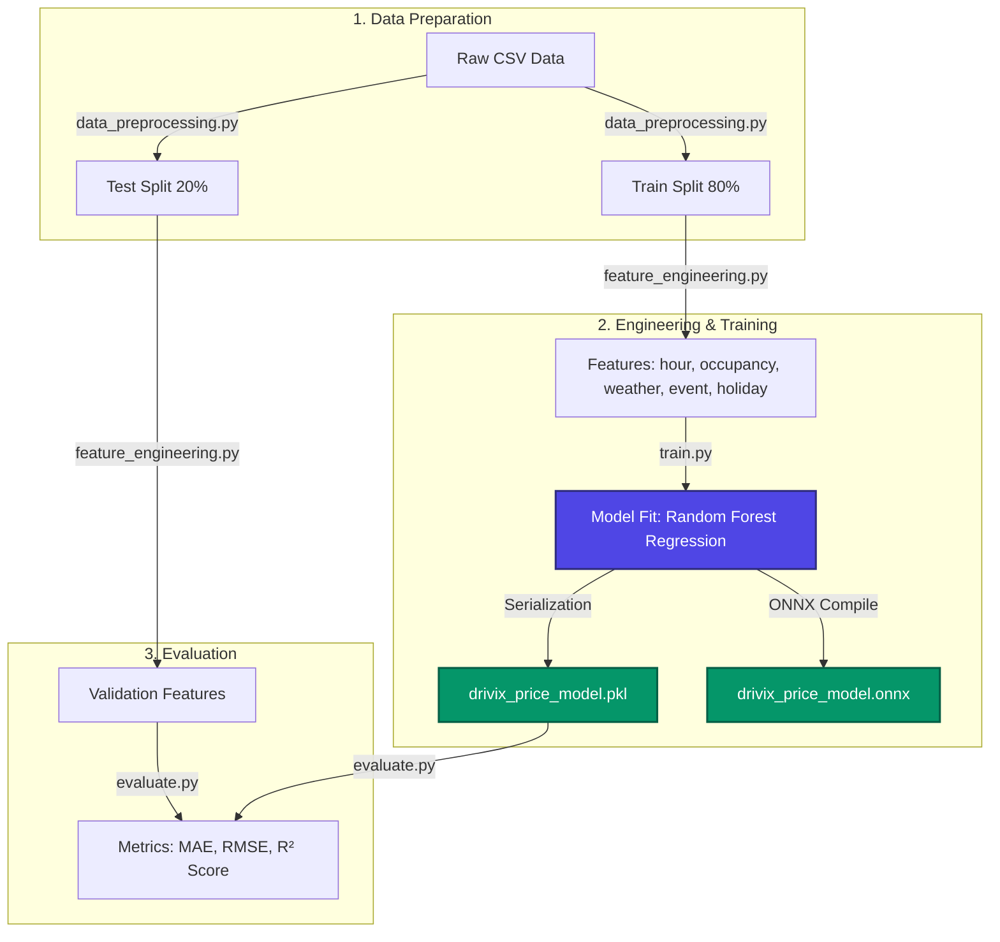
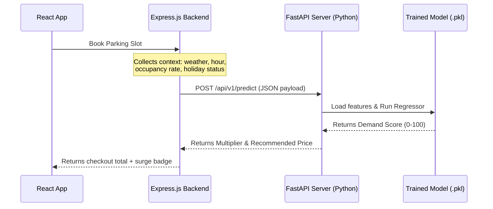
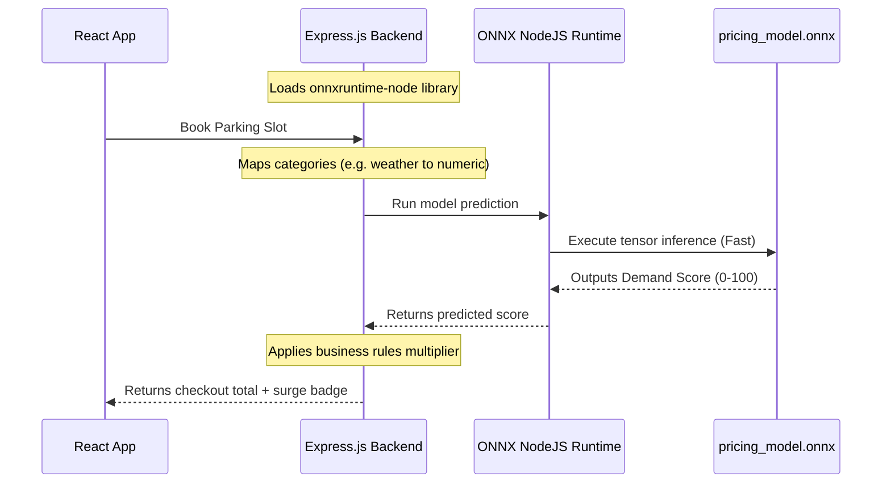

# Drivix Machine Learning Pricing Subsystem

This folder contains the folder structure and blueprints for building and integrating a Machine Learning model (e.g., Random Forest or XGBoost) to predict parking demand and automatically calculate dynamic hourly prices.

---

## 📊 Machine Learning Pipeline Workflow

The workflow is broken down into data collection, training, evaluation, and production deployment:



---

## ⚡ Integration Architectures (How it connects to Express.js)

Depending on your production requirements, choose one of these two integration flowcharts:

### Architecture A: Microservice REST API (FastAPI)
Suitable if you want to keep the Python model running as a separate service.



### Architecture B: Direct Native Execution (NodeJS + ONNX)
Suitable if you want a serverless setup without deploying a separate Python server.



---

## 📂 Directory Layout

```text
ml_service/
├── api/
│   ├── main.py                    # FastAPI Service Entrypoint (Placeholder)
│   └── routes.py                  # API endpoints and validators (Placeholder)
├── data/
│   ├── raw/
│   │   └── drivix_pricing_dataset.csv # Raw generated training data CSV (Headers only)
│   └── processed/                 # Folder for preprocessed train/test splits
├── models/                        # Folder to store compiled model artifacts (.pkl, .onnx)
├── notebooks/                     # Exploratory notebooks (blueprints)
│   ├── 01_data_audit.ipynb
│   ├── 02_eda.ipynb
│   ├── 03_feature_engineering.ipynb
│   └── 04_model_training.ipynb
├── src/
│   ├── data_preprocessing.py      # Cleans and splits raw data (Skeleton)
│   ├── feature_engineering.py     # Encodes categorical features (Skeleton)
│   ├── train.py                   # Model training and serialization script (Skeleton)
│   ├── evaluate.py                # Validation metrics evaluator (Skeleton)
│   └── predict.py                 # Single prediction caller script (Skeleton)
├── requirements.txt               # Required Python packages
└── README.md                      # Pipeline Documentation (This file)
```

---

## 📈 Feature Blueprint Schema

For training, variables are defined and mapped as follows:

| Feature Name | Type | Value Range | Description |
| :--- | :--- | :--- | :--- |
| `base_price` | `Float` | `40.0 - 100.0` | Standard base rate of the selected location. |
| `total_slots` | `Integer` | `50 - 200` | Full capacity of the selected location. |
| `available_slots` | `Integer` | `0 - 200` | Currently free slot count. |
| `occupancy_rate` | `Float` | `0.0 - 1.0` | Derived by: `(total_slots - available_slots) / total_slots`. |
| `hour` | `Integer` | `0 - 23` | Hour of day (Peak hours: 9-12 and 17-20). |
| `day_of_week` | `Integer` | `0 - 6` | Day of week (0 = Sunday, 6 = Saturday). |
| `weather_code` | `Integer` | `0 - 2` | Encoded categories: `{'clear': 0, 'rainy': 1, 'stormy': 2}`. |
| `is_holiday` | `Binary` | `0` or `1` | Public holiday indicator. |
| `nearby_event` | `Binary` | `0` or `1` | Concerts, sports, or local events indicator. |
| **`demand_score` (Target)** | `Integer` | `0 - 100` | Target prediction value, used to assign the multiplier. |
